# Predicting Charter Booking Cancellation 
[View Jupyter Notebook](Predicting%20Charter%20Booking%20Cancellation.ipynb)

### Problem Statement
A company that charters private jets has several years worth of bookings data and wants to see if they can develop a model to predict whether or not a booking will cancel. The company is always trying to minimize cancellations since it results in lost revenue and it can negatively affect the relationship between the company and the private jet owner who is supplying their aircraft for the trip. When a private jet owner approves charter trips on their aircraft, it means their aircraft will be unavailable during that time for their personal use, so it's never a fun conversation informing the private jet owner that the days they blocked out on their calendar as unavailable are suddenly available due to a cancellation. If the company is able to predict ahead of time with high accuracy whether a booking will cancel or not, they can take proactive measures to backfill a trip that is likely to cancel which would recover that lost revenue and ultimately achieve higher utilization rates across their fleet. This would be beneficial for both existing private jet owners as well as potential new private jet owners who want a company that can reliably charter their aircraft and ensure it maintains a high utilization rate.

### Approach
Since the final result we are trying to predict is a discrete variable (the charter booking either cancels or does not cancel) and we have a labeled dataset, this is a supervised learning, classification problem. In this analysis, I will explore the different features in the dataset and try out several classification models as well as a simple neural network to see if we can accurately predict whether a charter booking will cancel or not.

### Data Preparation and EDA (Exploratory Data Analysis) 
The dataset consists of 8,353 bookings from 2021 to 2025. The key findings during EDA were:
- The company changed their flight booking software system in 2021 which resulted in all existing bookings from the previous system being assigned the same Booking Date in the new system. This made it appear as if there were a lot of bookings in April 2021, but this is not true so these 894 bookings were removed bringing the dataset down to 7,459 bookings.
- 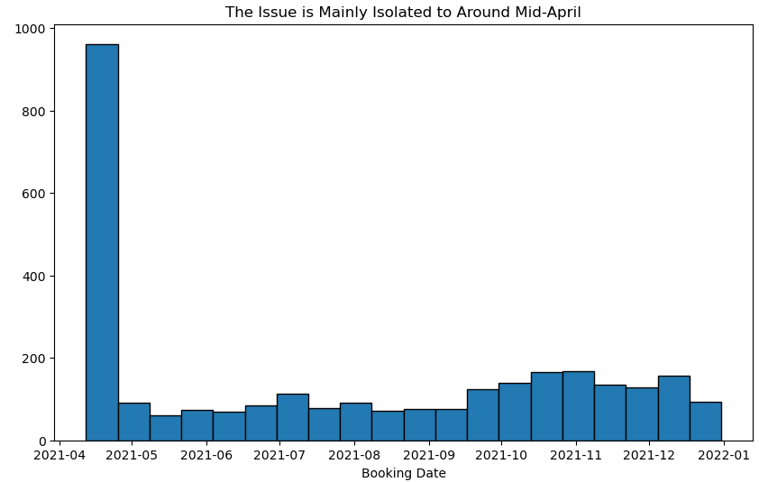

- The dataset didn't contain any duplicates, but it did have a good amount of missing values (20%-45%) in some columns such as Trip Class, Customer Segment, and Trip Category. These missing values were later imputed after splitting the data into a train set and test set to avoid data leakage. Missing values were imputed for Trip Class and Trip Category using the most frequent value, and a constant value of "New Retail" was imputed for Customer Segment under the assumption that if the customer segment value was missing, it was probably a new customer.
- There were some legitimate outliers and some incorrect outliers in the data. The incorrect/impossible outlier values were removed.
- Univariate analysis of the target variable revealed a class imbalance as only 28.5% of the bookings were cancellations.
- A correlation matrix of the numerical features indicated Flight Time having the strongest correlation with the target variable Status, but it was later discovered that this was due to the fact that Flight Time equaled 0 for every cancellation. For this reason, the Flight Time feature was dropped from the dataset since the model would just memorize that it was a cancellation every time Flight Time = 0 and therefore not generalize well to new data.
- 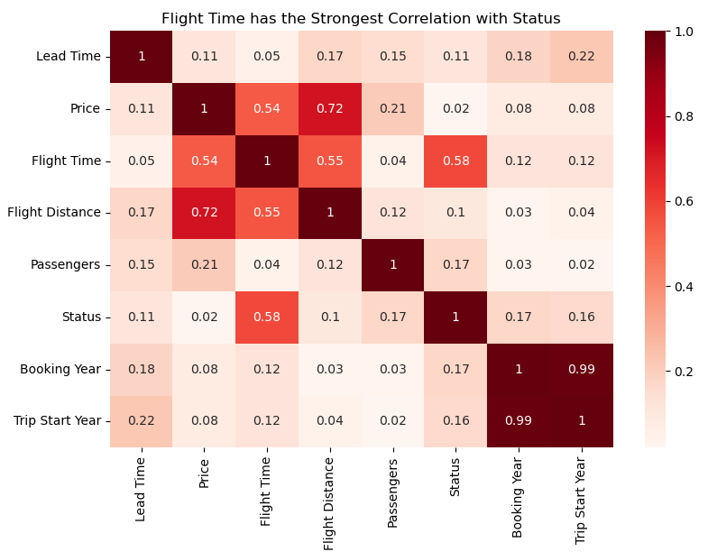
- During bivariate analysis it was found that the cancellation rate was much higher for Trip Type Charter | 135 compared to Subcharter | 135. For context, subcharter means the company is fulfilling the charter trip with another approved third party's aircraft rather than the private jet owner's aircraft that the company manages. Subcharter is also sometimes referred to as off-fleet or farmout in the industry, these terms are used interchangeably.
- 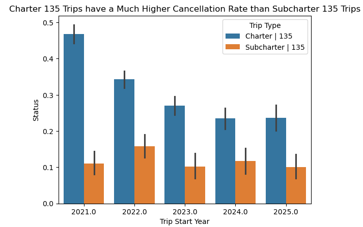
- The cancellation rate was significantly higher if the Origin of the booking was through Dispatch. However upon further investigation, it's important to note that the overwhelming majority of values (87%) in the Origin column were Email, so the number of bookings with Origin type Dispatch may not be large enough to confidently state that the cancellation rate is truly higher when flights are booked through Dispatch.
- 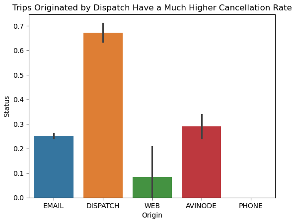
- 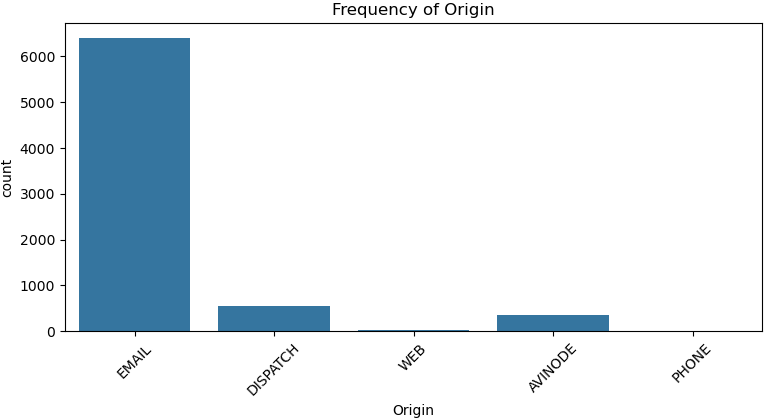
- Customers in the Key Account customer segment were found to have a higher cancellation rate than the other customer segments.
- 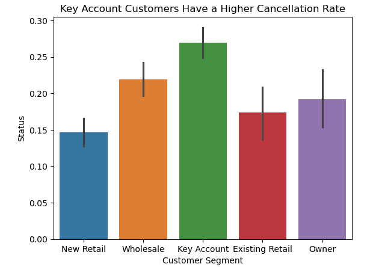
- Flights that depart in the last 4 months of the year (September, October, November, December) as well as March had higher cancellation rates than the other months.
- 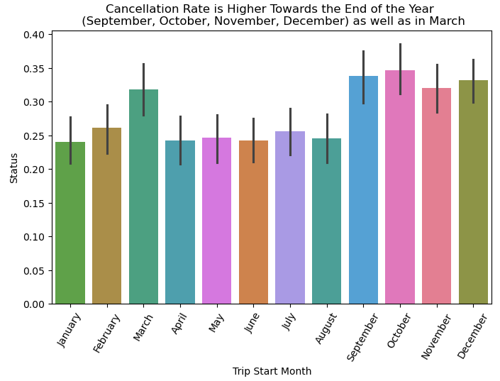

### Data Preprocessing & Feature Engineering
The cleaned dataset was split into 80% training data and 20% test data. Preprocessing and feature engineering included scaling the numerical features, imputing missing values, and encoding most categorical features with one hot encoding. One categorical column (i.e. Aircraft Size) was encoded using ordinal encoding since there is an inherent hierarchy for the different aircraft sizes. The final features selected for modeling were:

1. Lead Time - number of days from booking date to the trip's start date
2. Trip Type - charter vs subcharter
3. Origin - where the booking originated from (Email, Web, Phone, Dispatch, etc.)
4. Manufacturer - aircraft manufacturer
5. Size - aircraft size
6. Price - price of the charter trip
7. Flight Distance - distance of the flight in nautical miles
8. Passengers - number of passengers
9. Customer Segment - type of customer (New Retail, Key Account, Wholesale, etc.)
10. Trip Class - roundtrip vs one way trip
11. Trip Category - domestic vs international
12. Trip Start Month - month the trip started
13. Trip Start Day - day of the week the trip started
14. Status - whether the trip cancelled or not

### Modeling
The baseline model consisted of a dummy classifier that just predicted the most common outcome so its accuracy score was 72% (reflecting the class imbalance with our target variable where 72% did not cancel and 28% cancelled).

The classification models used were logistic regression, K-nearest neighbors, decision tree, SVM (Support Vector Machine), random forest, and a gradient boosting classifier. Evaluation metrics to measure model performance were accuracy, precision, recall, and F1 scores.

For this particular problem, the most important evaluation metric is the F1 score since both precision and recall are important in this scenario. A false negative (predicted charter booking won't cancel, but it does) would essentially be an unanticipated cancellation, which is not the worst thing but it does not sit well with the company's aircraft owners and their respective crewmembers since they blocked out part of the schedule/calendar and prepared for the trip. A false positive (predicted charter booking will cancel, but it doesn't) also causes some resource strain on the company since they would begin looking at what other trips they may be able to book on the respective aircraft that they are anticipating a cancellation for. So, the F1 score is a good evaluation metric to look at since it takes both of these into account. 

The first phase of modeling tried these 6 models with default parameters. The decision tree and random forest both suffered from overfitting, although random forest ended up being the best performing model with an F1 score of 54%. In general, we can see that the models did better with precision rather than recall, so they are having an easier time minimizing false positives, but a tougher time minimizing false negatives. In other words, the models are doing a fairly good job at predicting a cancellation when it was in fact a cancellation, but they are missing a lot of true cancellations and predicting that it won't cancel.
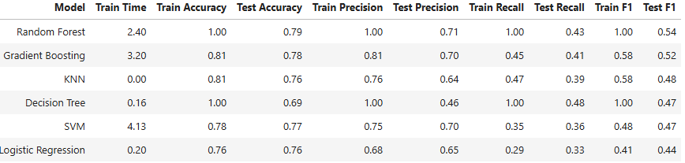

The second phase of modeling involved hyperparameter tuning with grid search to see if optimizing each model's parameters would improve performance. After hyperparameter tuning, certain models such as SVM slightly improved and other models such as Random Forest did slightly worse, but overall performance across the board didn't appear to improve.
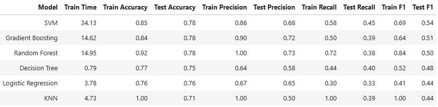

The third phase of modeling attempted to address the class imbalance issue using two techniques: SMOTE (Synthetic Minority Oversampling Technique) and Setting the Class_Weight Parameter in Certain Models to *Balanced*. Balancing the classes of the target variable to 50/50 using SMOTE did appear to improve performance, especially in terms of recall. The highest recall score before was 45% by the SVM model and every model after SMOTE exceeded 45% with logistic regression even achieving a recall score of 70% on the test data. However, this improvement seems to have come at the expense of precision scores as they have decreased. The random forest model achieved a 73% precision score previously, but it is now at 61% after SMOTE. Setting the class_weight parameter equal to 'balanced' for all the eligible models (i.e. not KNN or Gradient Boosting) seems to have had a similar effect as SMOTE, where we see improved recall scores but poorer precision scores. Overall the F1 scores improved, but it's still fairly low with our best performing models (SVM and Random Forest) only achieving an F1 score of 60%.
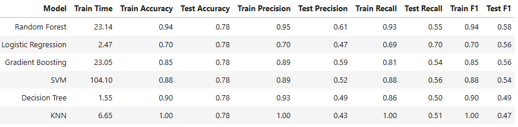
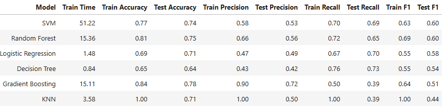
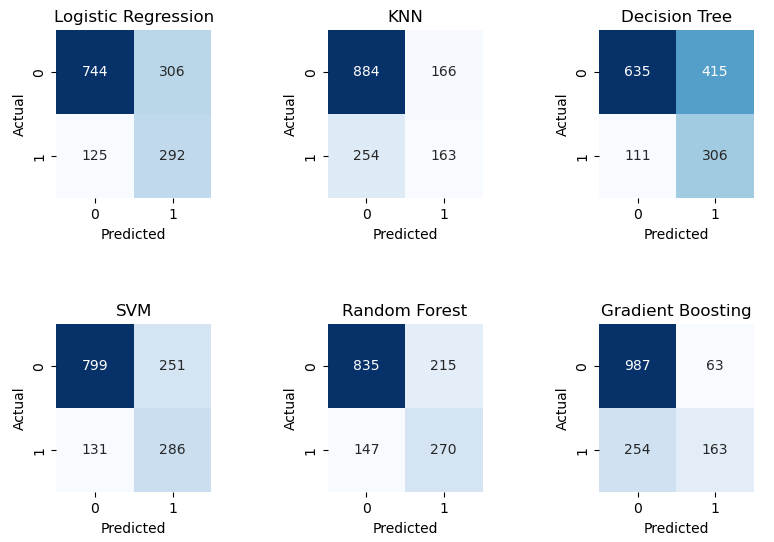

A relatively simple neural network model consisting of two hidden layers with 200 and 100 neurons respectively was also tried out, but it didn't perform any better than the traditional machine learning models. It achieved a 78% accuracy score, 72% precision score, and 40% recall score, so its performance was essentially the same as the six traditional machine learning models in the first and second phases of modeling.

### Findings
The nodes of the Decision Tree with its best parameters indicate that the most important feature was whether or not the trip type was Subcharter followed by the number of passengers and the price of the trip.
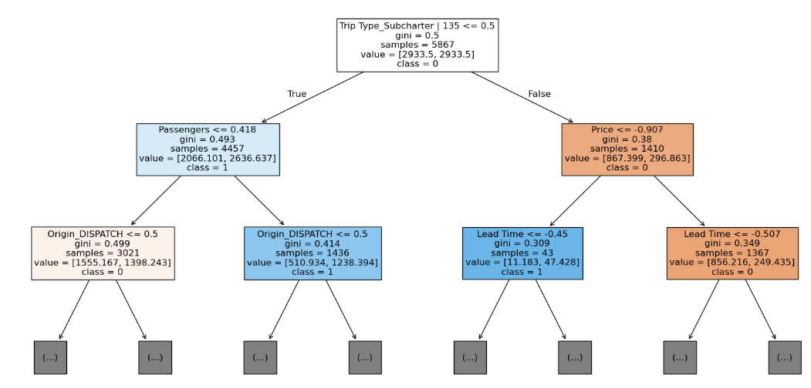
The SHAP plot of the Logistic Regression with its best parameters had similar conclusions in terms of feature importance although in slightly different order. Key findings from the SHAP plot:
- The most important feature was the number of passengers. The SHAP plot shows that higher numbers of passengers increase the likelihood of cancellation.
- Subcharter 135 trips decrease the likelihood of cancellation.
- Longer flight distance trips have a higher likelihood of cancellation.
- Higher priced trips have a lower likelihood of cancellation.
- Longer lead times have a higher likelihood of cancellation.
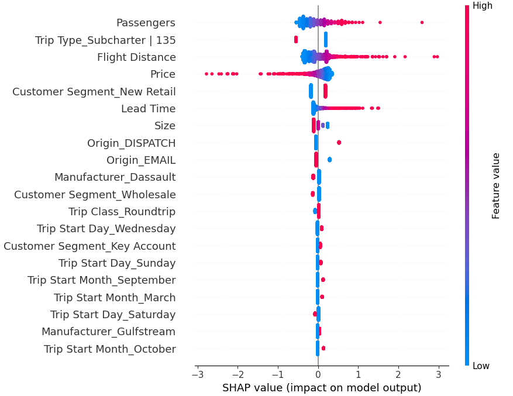

### Next Steps
None of the models really performed well enough to be considered for deployment into production, but this could potentially be improved through further improvements. In terms of next steps:
- Try to quantify the financial impact at different scores (e.g. how much revenue lost at 72% accuracy vs 85% accuracy) to get a better idea of what an acceptable threshold for scoring would be.
- Assign a $ value to false positives and false negatives to quantify whether it would be better for the models to be more picky or more flexible when predicting cancellations.
- Get more data, perhaps from another source, with similar features.
- Go back to the EDA and feature engineering stages, and try to improve the data quality through more extensive imputation techniques, generating new features, and better feature selection.

